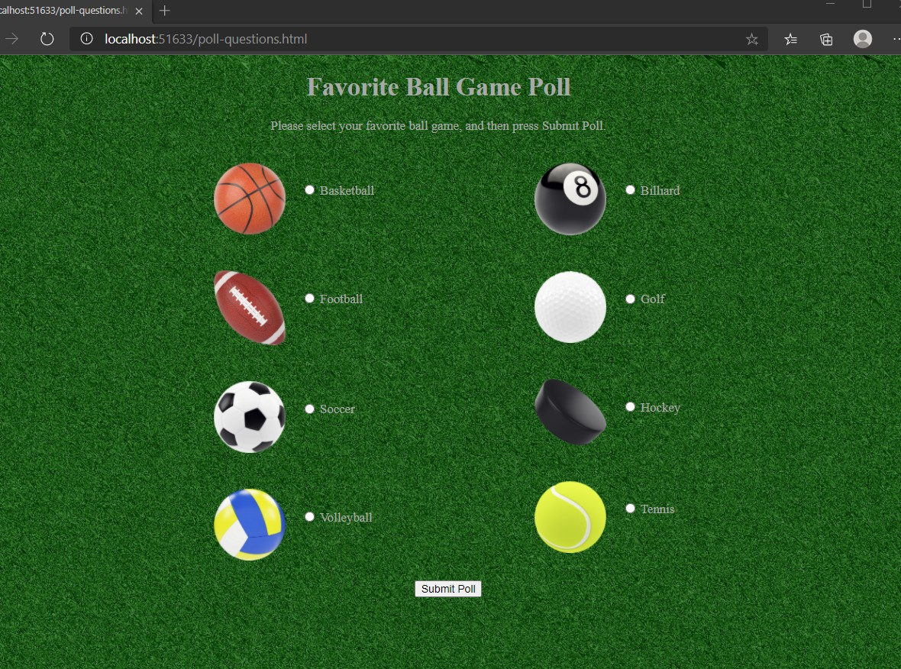

# Module 3: Configuring Middleware and Services in ASP.NET Core

## Lab: Configuring Middleware and Services in ASP.NET Core 

1. **Nombres y apellidos:** Francisco Javier Moreno Quevedo
2. **Fecha:** 06/12/2020
3. **Resumen del Ejercicio:**  Añadir los componentes necesarios para hacer funcional la aplicacion 2/4
4. **Dificultad o problemas presentados y como se resolvieron:** Ninguna


- Ejercicio 2: Creating Custom Middleware

  - En el middleware modificamos el metodo configure

  ```cs
      public void Configure(IApplicationBuilder app)
          {
  
              app.Use(async (context, next) =>
               {
                   if (context.Request.Query.ContainsKey("favorite"))
                   {
                       string selectedValue = context.Request.Query["favorite"];
                       await context.Response.WriteAsync("Selected value is: " + selectedValue);
                   }
                   else
                   {
                       await next.Invoke();
                   }
               });
  
              app.UseStaticFiles();
  
              app.Run(async (context) =>
              {
                  await context.Response.WriteAsync("This text was generated by the app.Run middleware.");
              });
          }
  ```

  - Ejecutamos y comprobamos el aspecto

  

  

- En el middleware modificamos el metodo configure moviendo app.UseStaticFiles(); al principio

```cs
    public void Configure(IApplicationBuilder app)
        {
			app.UseStaticFiles();
            app.Use(async (context, next) =>
             {
                 if (context.Request.Query.ContainsKey("favorite"))
                 {
                     string selectedValue = context.Request.Query["favorite"];
                     await context.Response.WriteAsync("Selected value is: " + selectedValue);
                 }
                 else
                 {
                     await next.Invoke();
                 }
             });

            

            app.Run(async (context) =>
            {
                await context.Response.WriteAsync("This text was generated by the app.Run middleware.");
            });
        }
```

- Ejecutamos y comprobamos el aspecto obteniendo la misma respuesta

  


- En el middleware modificamos el metodo configure moviendo app.UseStaticFiles(); a su posicion inicial y comentando el else

```cs
public void Configure(IApplicationBuilder app)
        {
            
            app.Use(async (context, next) =>
             {
                 if (context.Request.Query.ContainsKey("favorite"))
                 {
                     string selectedValue = context.Request.Query["favorite"];
                     await context.Response.WriteAsync("Selected value is: " + selectedValue);
                 }
                 /*else
                 {
                     await next.Invoke();
                 }*/
             });

            app.UseStaticFiles();

            app.Run(async (context) =>
            {
                await context.Response.WriteAsync("This text was generated by the app.Run middleware.");
            });
        }
```

- Ejecutamos y comprobamos el aspecto obteniendo una pagina en blanco ya que no se utiliza el metodo next.invoke()


